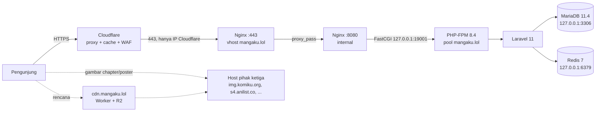

# Dokumentasi Sistem Mangaku

Dokumentasi teknis untuk **mangaku.lol**: server, aplikasi, keamanan, deployment, dan operasional harian.

> **Repo ini publik.** Jangan menulis IP server, email admin, password, isi `.env`, atau token apa pun di dokumen ini maupun di file lain yang di-commit. Nilai sensitif ditulis sebagai placeholder, misalnya `<IP-SERVER>`.

**Daftar isi**

1. [Ringkasan](#1-ringkasan)
2. [Arsitektur](#2-arsitektur)
3. [Stack & versi](#3-stack--versi)
4. [Server & CloudPanel](#4-server--cloudpanel)
5. [Struktur aplikasi](#5-struktur-aplikasi)
6. [Konfigurasi](#6-konfigurasi)
7. [Fitur khusus](#7-fitur-khusus)
8. [Keamanan](#8-keamanan)
9. [Deployment](#9-deployment)
10. [Operasional harian](#10-operasional-harian)
11. [CDN gambar (Cloudflare R2)](#11-cdn-gambar-cloudflare-r2)
12. [Troubleshooting](#12-troubleshooting)
13. [Riwayat perubahan](#13-riwayat-perubahan)
14. [Pekerjaan tertunda](#14-pekerjaan-tertunda)

---

## 1. Ringkasan

Mangaku adalah situs untuk membaca komik (manga, manhwa, manhua), novel, dan menonton anime dengan subtitle Indonesia.

| Item | Nilai |
|---|---|
| Domain | `mangaku.lol` (Cloudflare, proxied) |
| Aplikasi | Laravel 11 + Inertia.js (React) + Filament |
| Panel server | CloudPanel (Nginx saja, tanpa Apache) |
| OS | Ubuntu 24.04 LTS |
| Folder situs | `/home/mangaku/htdocs/mangaku.lol` |
| User situs | `mangaku` (PHP-FPM dan git berjalan sebagai user ini) |
| Repo | `github.com/haqqi20/manga`, branch `main` |

---

## 2. Arsitektur



**Alur request:**

1. Cloudflare menerima request dan meneruskannya ke server. Firewall server **hanya** menerima port 80/443 dari rentang IP Cloudflare.
2. Nginx `:443` (blok `server` utama) menangani SSL, lalu meneruskan request ke Nginx internal `:8080`. Pola ini bawaan CloudPanel.
3. Nginx `:8080` menjalankan PHP lewat PHP-FPM 8.4 di port `19001`, dengan document root `public/`.
4. Laravel memakai MariaDB untuk data, Redis untuk cache, dan tabel database untuk session dan queue.
5. **Gambar tidak disimpan di server.** Gambar chapter dan poster dimuat langsung dari host pihak ketiga. Rencana CDN ada di [bagian 11](#11-cdn-gambar-cloudflare-r2).

---

## 3. Stack & versi

| Komponen | Versi | Catatan |
|---|---|---|
| CloudPanel | CE v2 (CLI 6.0.8) | panel di port `8443` |
| Nginx | 1.30 | `clp-nginx` untuk panel, `nginx` untuk situs |
| PHP | **8.4** (FPM) | versi lain dimatikan (lihat 4.3) |
| MariaDB | 11.4 LTS | dipilih karena lebih ringan daripada MySQL 8.4 |
| Redis | 7.0 | cache (`CACHE_STORE=redis`) |
| Laravel | 11.x | |
| Inertia.js | 2.x (React 18) | frontend SPA |
| Filament | 5.x | panel admin tambahan di `/filament` |
| Vite | 5.4 | build frontend |
| Tailwind CSS | 3.x | |
| Node.js | 20 (build), 22 (wrangler) | **portabel**, bukan layanan sistem (lihat 9.3) |

---

## 4. Server & CloudPanel

### 4.1 Lokasi penting

| Path | Isi |
|---|---|
| `/home/mangaku/htdocs/mangaku.lol` | kode aplikasi (repo git) |
| `/home/mangaku/htdocs/mangaku.lol/public` | document root |
| `/home/mangaku/logs/nginx/` | `access.log`, `error.log` situs |
| `/home/mangaku/logs/php/error.log` | error PHP-FPM situs |
| `storage/logs/laravel.log` | log aplikasi |
| `/etc/nginx/sites-enabled/mangaku.lol.conf` | vhost situs (dibuat CloudPanel) |
| `/etc/nginx/cloudflare-realip.conf` | daftar IP Cloudflare untuk real IP |
| `/etc/php/8.4/fpm/pool.d/mangaku.lol.conf` | pool PHP-FPM situs |
| `/etc/mysql/mariadb.conf.d/200-local-hardening.cnf` | override MariaDB lokal |
| `/home/clp/htdocs/app/data/db.sq3` | database internal CloudPanel (SQLite) |
| `/root/cloudpanel-setup/` | backup konfigurasi, installer, Node/wrangler portabel |

### 4.2 Panel CloudPanel

- **URL:** `https://<IP-SERVER>:8443`
- **Akses port 8443:** hanya dari IP admin (lihat 8.1). Kalau IP admin berubah, tambahkan lewat SSH:
  ```bash
  ufw allow from <IP-BARU> to any port 8443 proto tcp
  ```

### 4.3 Layanan

| Layanan | Status | Alasan |
|---|---|---|
| `nginx`, `clp-nginx`, `clp-agent` | aktif | web server dan panel |
| `php8.4-fpm` | aktif | dipakai situs |
| `php8.3-fpm` | aktif | cadangan |
| `mariadb` | aktif | database |
| `redis-server` | aktif | cache aplikasi |
| `fail2ban` | aktif | proteksi brute-force SSH |
| `postfix` | aktif, **loopback-only** | kirim email keluar saja |
| `php7.1`–`8.2`, `php8.5-fpm` | **dimatikan** | hemat RAM, tidak dipakai |
| `varnish` | **dimatikan** | tidak cocok untuk Laravel dengan session login |
| `proftpd` | **dimatikan** | FTP tidak terenkripsi. Gunakan SFTP |
| `memcached` | **dimatikan** | tidak dipakai (cache memakai Redis) |

Menyalakan versi PHP lain jika dibutuhkan:

```bash
systemctl enable --now php8.2-fpm
```

### 4.4 Penyesuaian vhost

Vhost dibuat oleh CloudPanel dari template di database-nya. Semua perubahan di bawah ini **sudah disimpan ke file vhost dan ke template di database CloudPanel**, sehingga tetap ada saat pengaturan situs diubah dari panel.

| Perubahan | Alasan |
|---|---|
| `root .../mangaku.lol/public` | sebelumnya root di folder proyek, sehingga `.env`, `data.sql`, dan file zip bisa diunduh publik |
| PHP 8.4, port `19001` | sebelumnya 8.5. Laravel 11 resmi mendukung sampai 8.4 |
| `varnish_cache = 0` | Varnish dimatikan |
| `proxy_set_header CF-Connecting-IP $remote_addr;` | mencegah pemalsuan IP lewat header dari akses langsung |
| `location ~* ^/storage/.*\.(json\|php\|phar\|sql\|log\|env\|txt\|bak)$ { return 404; }` | `storage/app/public/settings.json` (berisi Google secret) tidak boleh diakses publik |

Kalau vhost diedit manual di tab **Vhost** CloudPanel, pastikan kelima poin di atas tetap ada.

### 4.5 PHP-FPM pool

`/etc/php/8.4/fpm/pool.d/mangaku.lol.conf`:

- `pm = ondemand`
- `pm.max_children = 30` (bawaan CloudPanel 250, terlalu besar untuk RAM 8 GB dengan `memory_limit` 512M)
- `pm.max_requests = 500`

### 4.6 MariaDB

`/etc/mysql/mariadb.conf.d/200-local-hardening.cnf`:

```ini
[mysqld]
bind-address = 127.0.0.1
skip-name-resolve
local-infile = 0
max_connections = 150
```

- **Database:** `anikomik`, dengan user `anikomik`.
- **Password:** ada di `.env`, dan database dikelola lewat CloudPanel → Databases.
- **Login root:** user root MariaDB tidak bisa login tanpa password. Kredensial master bisa dilihat dengan `clpctl db:show:master-credentials`.

### 4.7 Swap

Swap 2 GB di `/home/.swap`, dibuat oleh installer CloudPanel (`dphys-swapfile`).

---

## 5. Struktur aplikasi

### 5.1 Folder

```
app/
  Http/Controllers/           controller publik (Anime, Manga, Novel, Page, Sitemap, ...)
  Http/Controllers/Admin/     controller admin (Manga, Novel, Importer, Setting, Update, Ad)
  Http/Middleware/            SecurityHeaders, HandleInertiaRequests, CheckLicense,
                              EnsureIsAdmin, RewriteImageCdn
  Filament/                   panel Filament (/filament)
  Models/                     Anime, Manga, Chapter, ChapterImage, Novel, Page, User, ...
  Services/                   OtakudesuService, KiryuuNovelApiService, NovelApiRefreshService
cloudflare/                   Worker CDN gambar + wrangler.toml
config/cdn.php                konfigurasi CDN gambar
docs/                         dokumentasi ini
public/build/                 hasil build Vite (di-commit, lihat 9.3)
resources/js/Pages/           halaman Inertia (React)
resources/js/Pages/Admin/     halaman admin (Inertia)
resources/views/app.blade.php template root (meta SEO, OG, @routes)
routes/web.php                semua route web
storage/app/public/           upload dan settings.json (TIDAK di-commit)
```

### 5.2 Menu admin (`/admin`)

Menu admin bisa diakses user dengan `is_admin = 1`.

| Menu | Fungsi |
|---|---|
| Dashboard | statistik |
| Anime, Episode, Characters, Genre | kelola anime (import dari AniList dan Otakudesu) |
| Manga (Chapters) | kelola manga dan chapter (import dari Komiku), edit gambar chapter |
| Novel | kelola novel (sumber Kiryuu API) |
| Pages | halaman statis: `/terms`, `/privacy`, `/dmca`, `/contact` (lihat 7.1) |
| Reports | laporan chapter atau episode rusak dari pengguna |
| Users | badge, toggle admin, impersonate, hapus user |
| Ads | slot iklan |
| Settings | pengaturan situs (disimpan ke `storage/app/public/settings.json`) |
| License, Updater | lisensi dan pembaruan aplikasi |
| Pengaturan Profil (menu avatar) | ubah nama, password, dan avatar admin |

Panel Filament di `/filament` berisi resource Animes, Characters, Episodes, Genres, dan halaman profil.

### 5.3 Halaman publik utama

| URL | Keterangan |
|---|---|
| `/` | beranda |
| `/explore`, `/manga`, `/movies`, `/leaderboard` | daftar dan penjelajahan konten |
| `/manga/{slug}`, `/manga/{slug}/chapter/{n}` | detail manga dan pembaca chapter |
| `/anime/{slug}`, `/anime/{slug}/episode/{n}` | detail anime dan player (`anime` = `site_slug`) |
| `/library` | koleksi bacaan (wajib login) |
| `/settings` | ubah email dan password pengguna (wajib login) |
| `/u/{username}` | profil publik pengguna |
| `/terms`, `/privacy`, `/dmca`, `/contact` | halaman statis dari Admin → Pages |
| `/sitemap.xml` | sitemap index |

### 5.4 Tabel database

`users`, `animes`, `episodes`, `characters`, `staff`, `genres`, `anime_genre`, `mangas`, `manga_genre`, `chapters`, `chapter_images` (sekitar 16,5 juta baris), `novels`, `novel_genre`, `novel_chapters`, `novel_chapter_images`, `bookmarks`, `manga_bookmarks`, `watch_histories`, `manga_histories`, `character_favorites`, `follows`, `comments`, `reports`, `pages`, `license_settings`, `sessions`, `cache`, `cache_locks`, `jobs`, `job_batches`, `failed_jobs`, `password_reset_tokens`, `migrations`.

---

## 6. Konfigurasi

### 6.1 `.env` (nama variabel saja)

| Kelompok | Variabel |
|---|---|
| App | `APP_NAME`, `APP_ENV=production`, `APP_KEY`, `APP_DEBUG=false`, `APP_URL=https://mangaku.lol`, `APP_TIMEZONE`, `APP_LOCALE` |
| Database | `DB_CONNECTION=mysql`, `DB_HOST=127.0.0.1`, `DB_PORT`, `DB_DATABASE`, `DB_USERNAME`, `DB_PASSWORD` |
| Session/Queue/Cache | `SESSION_DRIVER=database`, `QUEUE_CONNECTION=database`, `CACHE_STORE=redis` |
| Redis | `REDIS_CLIENT=phpredis`, `REDIS_HOST=127.0.0.1`, `REDIS_PASSWORD=null`, `REDIS_PORT` |
| Mail | `MAIL_*` |
| Lisensi | `LICENSE_SERVER_URL`, `LICENSE_SECRET` |
| CDN gambar | `CDN_IMAGE_URL` (kosong berarti nonaktif, lihat 11) |

Setelah mengubah `.env`, jalankan:

```bash
sudo -u mangaku php8.4 artisan optimize
```

### 6.2 `storage/app/public/settings.json`

Pengaturan situs dari **Admin → Settings**. Isinya antara lain `site_name`, `site_slug`, logo, footer, `nav_links`, `legal_links`, sosial media, Discord, `google_login_enabled`, **`google_client_id` / `google_client_secret`**, dan sumber konten (`komiku_url`, `kanna_api_url`, `novel_*`).

- **Tidak di-commit**, karena folder `storage/` di-ignore.
- **Tidak bisa diakses publik**, karena diblokir di vhost (lihat 4.4).

### 6.3 `config/cdn.php`

Daftar host gambar yang dialihkan ke CDN dan ekstensi file yang diproses. Harus selaras dengan `ALLOWED_HOSTS` di `cloudflare/cdn-worker.js`.

---

## 7. Fitur khusus

### 7.1 Halaman statis (Admin → Pages)

- **Route:** `Route::fallback([PageController::class, 'show'])`. Route ini hanya dipakai kalau tidak ada route lain yang cocok.
- **Tampilan:** hanya halaman berstatus **published** yang tampil, di URL `/{slug}` dengan komponen React `resources/js/Pages/StaticPage.jsx` (layout situs, breadcrumb, tanggal "Terakhir diperbarui").
- **Konten:** ditulis dalam **HTML**. Class `.note` tersedia untuk kotak catatan.
- **SEO:** `meta_title` dan `meta_description` dipakai untuk `<title>`, `meta description`, dan OG. Kalau kosong, sistem memakai judul halaman dan potongan awal konten.
- **Validasi slug:** hanya `a-z`, `0-9`, dan `-`, dan tidak boleh sama dengan segmen route bawaan (`library`, `explore`, `login`, dan lainnya).

### 7.2 SEO

- **Meta description per halaman:** `resources/views/app.blade.php` membaca `props.og.description`. Kalau kosong, dipakai deskripsi default Mangaku.
- **Canonical dan OG:** diisi dari `props.og` (`title`, `description`, `url`, `type`, `image`).
- **`noindex`:** komponen `Manga/Show`, `Manga/Read`, `Novel/Show`, `Novel/Read`, `Anime/Show`, dan `Anime/Player` diberi `noindex, nofollow` (lihat [14](#14-pekerjaan-tertunda)).
- **Sitemap:**
  - `/sitemap.xml` adalah sitemap index.
  - `/sitemap/static.xml` berisi beranda, explore, halaman published, dan genre.
  - `/sitemap/{anime|episode|manga|chapter}/{n}.xml` berisi maksimal 10.000 URL per file.
- **`public/robots.txt`:** berisi `Sitemap: https://mangaku.lol/sitemap.xml`.

### 7.3 Image proxy admin

`GET /image-proxy?url=...` dipakai di halaman edit chapter admin untuk pratinjau gambar.

- **Akses:** wajib login sebagai **admin**.
- **URL yang diterima:** hanya `http`/`https` ke **IP publik**, tanpa redirect. IP sudah dipin untuk mencegah DNS rebinding.
- **Respons:** hanya tipe `image/*` (bukan SVG), maksimal 20 MB, dengan header `X-Content-Type-Options: nosniff`.

### 7.4 Profil admin

`POST /admin/profile` menjalankan `AdminController@updateProfile` untuk mengubah nama, password (minimal 8 karakter, wajib dikonfirmasi), dan avatar (maksimal 2 MB). Pesan validasinya berbahasa Indonesia. Email login diubah lewat `/settings`.

### 7.5 Penulisan ulang URL gambar ke CDN

Middleware global `App\Http\Middleware\RewriteImageCdn` bekerja begini:

- **Aktif hanya jika** `CDN_IMAGE_URL` diisi.
- **Mengubah respons HTML dan JSON:** `https://img.komiku.org/a/b.jpg` menjadi `https://cdn.mangaku.lol/img.komiku.org/a/b.jpg`.
- **Yang diubah:** hanya URL berekstensi gambar dari host di `config/cdn.php`. Link sumber dan API tidak tersentuh.
- **Database tidak diubah.** Untuk mematikannya, kosongkan `CDN_IMAGE_URL` lalu jalankan `artisan optimize`.

---

## 8. Keamanan

### 8.1 Firewall (UFW)

| Port | Sumber | Keterangan |
|---|---|---|
| 22/tcp | semua IP | `LIMIT` (rate-limit) + fail2ban |
| 80, 443/tcp, 443/udp | **hanya IP Cloudflare** | server tidak bisa diakses langsung lewat IP |
| 8443/tcp | IP admin saja | panel CloudPanel |
| lainnya | ditolak | default `deny incoming` |

- **Sinkron dengan panel:** rule yang sama juga disimpan di tabel `firewall_rule` database CloudPanel, supaya tidak tertimpa saat menu **Security → Firewall** di panel disimpan.
- **DNS wajib Proxied:** kalau record DNS di Cloudflare diubah ke "DNS only" (awan abu-abu), situs tidak bisa diakses.
- **IP Cloudflare berubah:** perbarui rule UFW dan `/etc/nginx/cloudflare-realip.conf` dari `https://www.cloudflare.com/ips-v4` dan `ips-v6`.

### 8.2 Real IP pengunjung

- `nginx.conf`: `set_real_ip_from 0.0.0.0/0` **dinonaktifkan** karena bisa dipalsukan, lalu diganti `include /etc/nginx/cloudflare-realip.conf` (rentang IP Cloudflare dan `real_ip_header CF-Connecting-IP`).
- Vhost menulis ulang `CF-Connecting-IP` sebelum meneruskan request ke `:8080`.

### 8.3 Checklist hardening yang sudah diterapkan

- [x] Document root di `public/`, sehingga `.env`, `data.sql`, dan `composer.json` tidak bisa diakses
- [x] `/storage/*.json|php|sql|log|env|txt|bak` diblokir (melindungi `settings.json`)
- [x] Server hanya menerima trafik web dari Cloudflare
- [x] Panel 8443 hanya dari IP admin
- [x] MariaDB, Redis, dan Postfix hanya localhost
- [x] Varnish, FTP, dan Memcached dimatikan
- [x] Real IP hanya dipercaya dari Cloudflare
- [x] `/image-proxy` hanya untuk admin, dengan proteksi SSRF dan XSS
- [x] Header keamanan dari middleware `SecurityHeaders` (HSTS, nosniff, X-Frame-Options, Referrer-Policy)
- [x] `APP_DEBUG=false`
- [x] `.env` dengan permission `640`

---

## 9. Deployment

### 9.1 Git dan deploy key

- **Remote:** `git@github-manga:haqqi20/manga.git`, yaitu alias SSH di `/home/mangaku/.ssh/config`.
- **Deploy key:** `/home/mangaku/.ssh/github_deploy_manga` (ed25519, dengan write access).
- **Jalankan git sebagai user `mangaku`**, bukan root:
  ```bash
  cd /home/mangaku/htdocs/mangaku.lol
  sudo -u mangaku git status
  ```

### 9.2 Update situs dari GitHub

```bash
cd /home/mangaku/htdocs/mangaku.lol
sudo -u mangaku php8.4 artisan down --retry=30        # opsional: mode maintenance
sudo -u mangaku git pull
sudo -u mangaku composer install --no-dev --optimize-autoloader   # jika composer.lock berubah
sudo -u mangaku php8.4 artisan migrate --force        # jika ada migrasi baru
sudo -u mangaku php8.4 artisan optimize
sudo -u mangaku php8.4 artisan filament:optimize
systemctl reload php8.4-fpm                           # bersihkan OPcache
sudo -u mangaku php8.4 artisan up
```

Terakhir, purge cache Cloudflare kalau ada perubahan tampilan yang belum terlihat.

### 9.3 Build frontend

`public/build/` **di-commit**, supaya server tidak perlu Node. Kalau ada perubahan di `resources/js` atau `resources/css`, build ulang dulu lalu commit hasilnya.

Di server, Node 20 portabel tersedia di `/root/cloudpanel-setup/node`, dan build dilakukan di salinan proyek supaya `node_modules` tidak masuk ke folder situs:

```bash
B=/root/cloudpanel-setup/build; P=/home/mangaku/htdocs/mangaku.lol
rsync -a --delete $P/resources/ $B/resources/
cd $B && rm -rf public/build && PATH=/root/cloudpanel-setup/node/bin:$PATH npx vite build
# Salin aset baru TANPA menghapus aset lama (pengunjung yang masih memuat versi lama tidak error)
rsync -a $B/public/build/assets/ $P/public/build/assets/
cp $B/public/build/manifest.json $P/public/build/manifest.json
chown -R mangaku:mangaku $P/public/build
```

Di komputer lokal, cukup `npm ci && npm run build`, lalu commit folder `public/build`.

### 9.4 Commit dan push dari server

```bash
cd /home/mangaku/htdocs/mangaku.lol
sudo -u mangaku git add -A
sudo -u mangaku git commit -m "pesan perubahan"
sudo -u mangaku git push
```

### 9.5 Yang tidak di-commit (`.gitignore`)

`.env`, `vendor/`, `node_modules/`, `storage/*` (upload, log, `settings.json`), `*.sql`, `*.zip`, `/tmp/`, `*.bak`, dan file debug lokal.

---

## 10. Operasional harian

### 10.1 Perintah umum

```bash
# Status layanan
systemctl status nginx php8.4-fpm mariadb redis-server fail2ban --no-pager

# Reload setelah mengubah konfigurasi
nginx -t && systemctl reload nginx
php-fpm8.4 -t && systemctl reload php8.4-fpm

# Laravel
cd /home/mangaku/htdocs/mangaku.lol
sudo -u mangaku php8.4 artisan optimize:clear   # hapus semua cache
sudo -u mangaku php8.4 artisan optimize         # bangun ulang cache

# Log
tail -f /home/mangaku/logs/nginx/error.log
tail -f storage/logs/laravel.log

# Firewall & fail2ban
ufw status numbered
fail2ban-client status sshd
```

### 10.2 Backup database

Cara paling mudah: **CloudPanel → Databases → Export**. Bisa juga lewat CLI:

```bash
mkdir -p /root/backups
clpctl db:export --databaseName=anikomik --file=/root/backups/anikomik-$(date +%F).sql.gz
```

Simpan backup di luar server, dan **jangan di-commit** (`*.sql` dan `*.sql.gz` sudah di-ignore).

### 10.3 Akun admin

- **Ubah nama, password, atau avatar:** Admin → menu avatar → **Pengaturan Profil**.
- **Ubah email:** `/settings`.
- **Reset darurat lewat CLI** (password diketik tersembunyi):
  ```bash
  cd /home/mangaku/htdocs/mangaku.lol && read -p "Email: " E && read -s -p "Password baru: " PW && echo && \
  sudo -u mangaku E="$E" PW="$PW" php8.4 artisan tinker --execute='$u=App\Models\User::where("email",getenv("E"))->firstOrFail(); $u->password=Hash::make(getenv("PW")); $u->save(); echo "OK\n";'
  ```

### 10.4 Scheduler dan queue

- **Scheduler:** `routes/console.php` saat ini tidak berisi tugas penting, sehingga cron `schedule:run` belum dipasang.
- **Queue:** `QUEUE_CONNECTION=database`, tapi saat ini tidak ada job yang di-dispatch, sehingga worker belum dipasang.
- **Kalau nanti dibutuhkan:** tambahkan cron di **CloudPanel → Sites → Cron Jobs**:
  ```
  * * * * * php8.4 /home/mangaku/htdocs/mangaku.lol/artisan schedule:run >> /dev/null 2>&1
  ```

---

## 11. CDN gambar (Cloudflare R2)

**Status: disiapkan, belum aktif.**

### 11.1 Data gambar saat ini

| Jenis | Jumlah unik | Rata-rata | Perkiraan total | Sumber |
|---|---|---|---|---|
| Gambar chapter | ±16,45 juta | ±198 KB | **±3,3 TB** | img.komiku.org, img1/img2.komiku.org, image1–14.komiku.to |
| Poster manga | ±7.700 | ±102 KB | ±780 MB | thumbnail.komiku.org/.to |
| Poster anime dan karakter | ±1.870 | ±160 KB | ±300 MB | s4.anilist.co |
| Poster novel | ±1.330 | kecil | ±40 MB | novel.kiryuuid.net (tidak bisa diakses dari IP server) |

Sekitar 0,5% gambar chapter sudah mati di sumbernya.

### 11.2 Cara kerja (metode "otomatis saat dibuka")

```
https://cdn.mangaku.lol/<host-sumber>/<path>
   └─ Worker: cache edge → R2 → (belum ada) ambil dari sumber → simpan ke R2 → kirim
```

- **Kode Worker:** `cloudflare/cdn-worker.js`, dengan konfigurasi `cloudflare/wrangler.toml` (bucket `mangaku-images`, custom domain `cdn.mangaku.lol`).
- **Pengaman:**
  - hanya host dalam allowlist
  - hanya ekstensi gambar
  - hanya respons `image/*` yang disimpan, maksimal 20 MB
  - anti-hotlink (Referer harus `mangaku.lol` atau kosong)
  - hanya method GET/HEAD
- **Diagnostik:** header `X-CDN-Source` bernilai `edge-cache`, `r2`, atau `origin`.

### 11.3 Langkah aktivasi

1. **Siapkan akun Cloudflare:** aktifkan **R2** dan **Workers Paid** ($5/bulan).
2. **Buat API Token** dengan izin:
   - **Account:** Workers Scripts Edit dan Workers R2 Storage Edit.
   - **Zone mangaku.lol:** Workers Routes Edit dan DNS Edit.
3. **Simpan kredensial di server:** jalankan `/root/cloudpanel-setup/cf-token.sh`. Kredensial tersimpan di `/root/cloudpanel-setup/.cf-env`.
4. **Deploy Worker:**
   ```bash
   set -a; . /root/cloudpanel-setup/.cf-env; set +a
   export PATH=/root/cloudpanel-setup/node22/bin:$PATH
   W=/root/cloudpanel-setup/wrangler/node_modules/.bin/wrangler
   $W r2 bucket create mangaku-images
   cd /home/mangaku/htdocs/mangaku.lol/cloudflare && $W deploy
   ```
5. **Uji:** buka `https://cdn.mangaku.lol/img.komiku.org/<path-gambar>.jpg`.
6. **Aktifkan di aplikasi:** isi `.env` dengan `CDN_IMAGE_URL=https://cdn.mangaku.lol`, lalu jalankan `artisan optimize`.
7. **Perbarui halaman legal:** ubah **/dmca, /terms, /privacy** di Admin → Pages, karena gambar kini disimpan di R2, dan tambahkan prosedur penghapusan objek R2 untuk takedown.

### 11.4 Perkiraan biaya

| Skenario | Biaya |
|---|---|
| Otomatis saat dibuka (hanya chapter yang dibaca) | $5 Workers + ±$1,5 per 100 GB tersimpan + $4,50 per juta gambar baru |
| Semua gambar disalin (±3,3 TB) | ±$50/bulan penyimpanan + ±$70 sekali bayar (16,5 juta operasi tulis) |
| Bandwidth ke pengunjung | gratis (R2 tanpa biaya egress) |

Alternatif gratis: cache Nginx di server ditambah cache Cloudflare. Gambar tidak tersimpan permanen, jadi tetap bergantung pada sumber.

---

## 12. Troubleshooting

| Gejala | Penyebab umum | Solusi |
|---|---|---|
| Situs tidak bisa dibuka sama sekali | DNS diubah ke "DNS only" | Aktifkan Proxied (awan oranye) di Cloudflare |
| Panel 8443 timeout | IP admin berubah | `ufw allow from <IP> to any port 8443 proto tcp` lewat SSH |
| Error 502 | PHP-FPM mati | `systemctl restart php8.4-fpm`, lalu cek `/home/mangaku/logs/php/error.log` |
| Error 500 | error aplikasi | cek `storage/logs/laravel.log` |
| Perubahan kode tidak muncul | cache Laravel atau OPcache | `artisan optimize` + `systemctl reload php8.4-fpm` |
| Perubahan tampilan tidak muncul | cache Cloudflare atau browser | purge cache Cloudflare, lalu Ctrl+F5 |
| Halaman dari Admin → Pages 404 | status draft atau slug tidak valid | ubah ke Published dan cek slug |
| Tombol simpan di admin tidak bereaksi | route belum terdaftar di `web.php` | cek console browser (error Ziggy "route not in list") |
| Login gagal terus | rate limit (5 kali percobaan) | tunggu 1 menit, atau reset password lewat CLI (10.3) |
| IP pengunjung di log salah | IP Cloudflare berubah | perbarui `/etc/nginx/cloudflare-realip.conf` |

---

## 13. Riwayat perubahan

**2026-09-28: setup awal server**

- **Server:**
  - Instal CloudPanel dengan MariaDB 11.4 dan swap 2 GB.
  - Matikan PHP-FPM yang tidak dipakai, Varnish, ProFTPD, dan Memcached.
  - Postfix dan MariaDB hanya bisa diakses dari localhost.
- **Firewall:**
  - UFW: web hanya dari Cloudflare, panel hanya dari IP admin, SSH dengan rate-limit.
  - Rule disinkronkan ke database CloudPanel.
- **Nginx:**
  - Real IP hanya dari Cloudflare, header `CF-Connecting-IP` ditulis ulang.
  - Document root dipindah ke `public/`, dan `/storage/*.json` diblokir.
- **Situs:** PHP 8.4, import database (±2,8 GB), `storage:link`, cache Laravel.
- **Perbaikan aplikasi:**
  - Route `admin.profile.update` yang hilang, plus pesan validasi berbahasa Indonesia.
  - Halaman statis `/terms`, `/privacy`, `/dmca`, `/contact` (sebelumnya 404) beserta konten E-E-A-T.
  - Meta description per halaman.
  - Route sitemap (sebelumnya 404) dan `robots.txt` dengan URL sitemap lengkap.
  - Validasi slug halaman.
  - Penutupan celah SSRF/XSS di `/image-proxy`.
- **Persiapan CDN:** middleware `RewriteImageCdn`, `config/cdn.php`, dan Worker Cloudflare (belum aktif).
- **Git:** repo `haqqi20/manga` dengan deploy key.

---

## 14. Pekerjaan tertunda

- [ ] **Ganti Google OAuth Client Secret** di Google Cloud Console dan Admin → Settings. Secret lama sempat bisa diakses publik lewat `/storage/settings.json`.
- [ ] **Aktifkan email `contact@mangaku.lol`** lewat Cloudflare Email Routing. Alamat ini dipakai di halaman Kontak, DMCA, dan Privasi.
- [ ] **Putuskan kebijakan `noindex`** untuk halaman manga, chapter, dan anime. Saat ini halaman itu `noindex` tetapi tercantum di sitemap, sehingga sinyalnya bertentangan.
- [ ] **Aktifkan CDN R2** (bagian 11) kalau diinginkan.
- [ ] **Pasang SSH key untuk root**, lalu matikan login SSH dengan password.
- [ ] **Hapus `data.sql` (2,4 GB) dan `mangaku.zip`** dari folder situs setelah backup database tersimpan di tempat lain.
- [ ] **Pertimbangkan repo GitHub Private.**
- [ ] **Pertimbangkan halaman "Tentang Kami" (`/about`)** untuk E-E-A-T.
- [ ] **Perbaiki kolom `users.avatar_url`**, yang terlalu pendek untuk URL avatar Google yang panjang (ada error "Data too long" di log lama).
